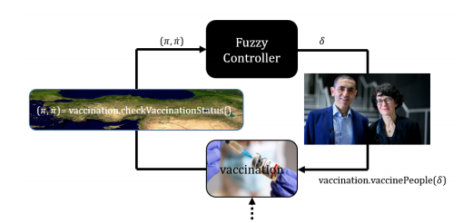

# Covid19 vaccination with fuzzy control

&nbsp;&nbsp;&nbsp;&nbsp;Novel coronavirus disease (COVID-19) was firstly identified in 2019 in Wuhan, China and it spread all
around of the world in a short amount of time. Currently, more than 150 million cases and 3 million
deaths are reported. Luckily, some vaccines have been introduced. Countries are hoping to have a herd
immunity after a specific percentage of vaccination. However, there is not enough vaccine available for
every country to vaccinate everybody.

&nbsp;&nbsp;&nbsp;&nbsp;The point of this story is creating a herd immunity and controlling it with limited amount of vaccine.
In this code, we will create a herd immunity by vaccinating people. Our aim is to vaccinate 60%
of the people in your country and maintain that percentage. In this way, we will protect 100% of the
people from the virus with limited amount of vaccine

 &nbsp;&nbsp;&nbsp;&nbsp;We vaccinate people to get them immune to the virus. Assume that we have conducted the required
research on the relation between the vaccination rate and birth-death rates as well. Hence, we are able
control the vaccination rate in terms of percentage per day. In that manner, setting vaccination rate to
some x
%
day means that the percentage of the vaccinated people will be increased by x; namely, if the
current percentage were p then the percentage after a day would be p + x. On the other hand, our
research has revealed that there exists a failure rate for the vaccine owing to the nature of it. Assume
that the failure rate is proportional to the percentage of the vaccinated people. In other words, the
more people get vaccinated, the more rapidly failed your vaccination will be. We can also measure
that rate in terms of percentage per day. Therefore, there is an effective vaccination rate which is the
difference between the vaccination rate controlled by us and the failure rate. The task is to provide
proper control for the vaccination rate so that the percentage of the vaccinated people is to come to the
equilibrium at 60% as quickly as possible.

**Input Variables and Control Variable**

The input variables are the two measurements which are the current percentage of the vaccinated people,
π ∈ [0, 1] ,
and the current effective vaccination rate,
π˙ ∈ [−1, 1] .
The control variable,
δ ∈ [−0.25, 0.25]
is the vaccination rate to be added to the current vaccination rate. Note that the control variable allows
to increase or decrease the vaccination rate and its maximum magnitude is limited to 0.25.

Below figure shows the flow of the vaccination:

**Vaccination v1**

&nbsp;&nbsp;&nbsp;&nbsp;In this version of the vaccination process, we have not researched the failure rates yet. Thus, we can
only measure the current percentage of the vaccinated people. In this manner, we will design a fuzzy controller
which takes π as the input and provides δ as the output to vaccinate 60% of the people and maintain
that percentage.

**Vaccination v2**

&nbsp;&nbsp;&nbsp;&nbsp;We decide to conduct research on the failure rates to develop our vaccination process after we have
observed the behavior of the previous version of our vaccination process. We want to decrease the
overshoot and increase the convergence rate to the equilibrium. We have made our research and now
we can measure the current effective vaccination rate which is the difference between the controlled
vaccination rate and the failure rate. In this manner, we will design a fuzzy controller which takes π and ˙π as
the inputs and provides δ as the output to vaccine 60% of the people and maintain that percentage.
